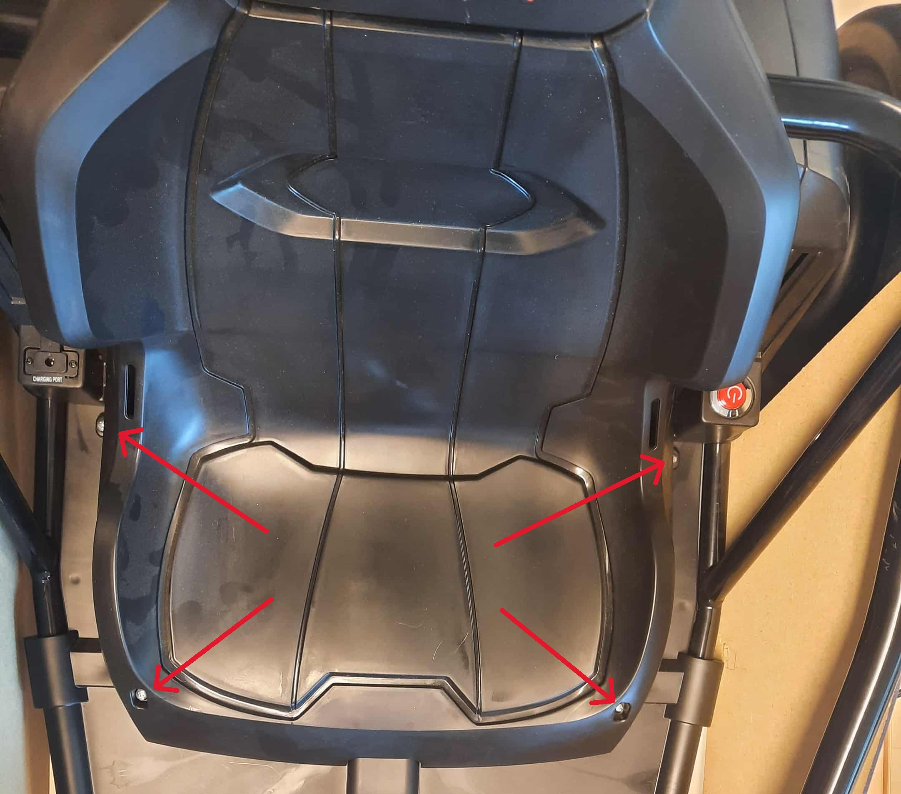
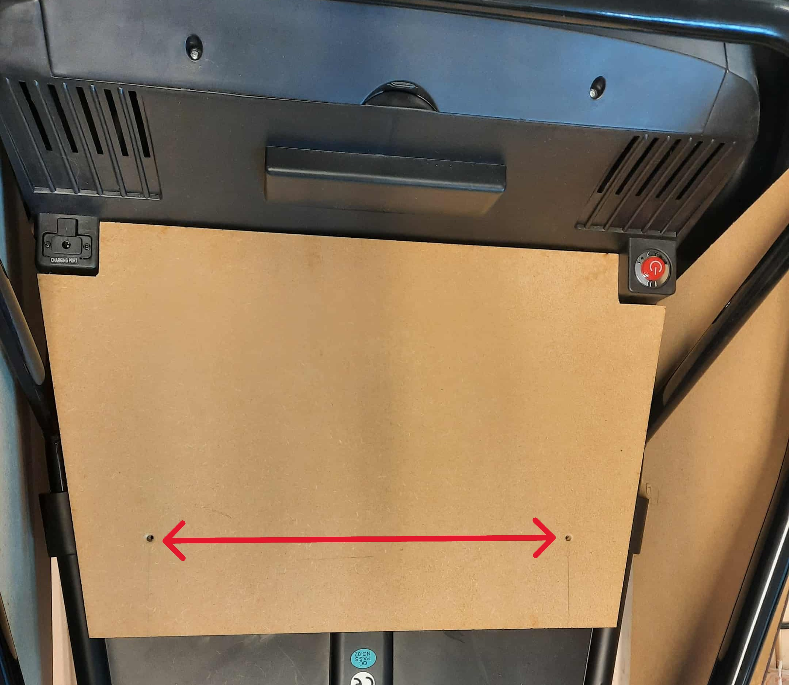

# Legende
[**Installatie van de Joystick**](#Joystick%20installeren) 

[**Begrenzen van de snelheid**](#Snelheidsbegrenzing) 

## Joystick installeren

## Snelheidsbegrenzing

1) Eerst open je de bescherming die aan de onderkant zit van de auto, dit doe je door de vijsjes los te maken. 
Nadat je het geopend hebt, vind je hier de schakelaar (de opening die in het blauw omcirkelt is). 
Deze schakelaar maak je los, alsook de connector van de paarse en de zwarte draad.

**Bescherming en Binnenkant**

   
   

**Schakelaar**

   
   

2) Nadat je de schakelaars los hebt gekregen, alsook de paarse draad. Knip je de connector van de paarse draad door.
   Steek de paarse draad onder het metalen gedeelte zodanig dat het goed aangespannen is en hij niet snel zal los komen.
   Nu soldeer je de paarse draad aan de connector van de zwarte draad. 

**De gesoldeerde verbinding**

## Montage Grondplaat
1. We moeten eerst de stoel die al op de auto is aangesloten demonteren van de auto, dus alle vijzen losmaken die worden aangeduid met de rode pijlen.

2. Als dit gebeurd is, monteer je nu de gelasercutte grondplaat op de auto.

3. Zodra je dit hebt gedaan, kun je de vijzen monteren op de plaatsen waar de rode pijlen naar wijzen.

  

