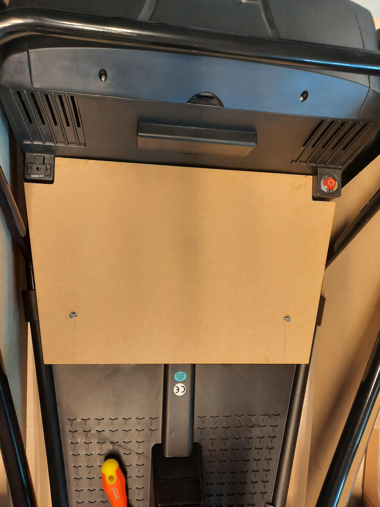

# Handleiding om de auto om te bouwen
[**Benodigdheden om te auto om te bouwen**](#Benodigdheden)

[**Gereedschap benodigheden**](#Gereedschap)

[**Handleiding om de auto om te bouwen met de knop**](#Handleiding-om-auto-om-te-bouwen-met-knop)

[**Handleiding om de auto om te bouwen met de joystick**](#Handleiding-om-auto-om-te-bouwen-met-joystick)

## Benodigdheden 
Hier vindt u alle benodigdheden die u nodig heeft om 1 auto om te bouwen.

[**Benodigheden knop**](#Knop)

[**Benodigheden joystick**](#Joystick)

### Knop

1) 1x: Knop Ergo
2) 2x: [Seconden Epoxylijm](https://www.hubo.be/nl/p/pattex-super-mix-universal-mini-epoxy-colle-bi-composant-6ml/249565/#specs) 
3) 4x: [Buizenklem 32mm](https://www.hubo.be/nl/p/astore-buisklem-32mm-polypropyleen/890700/)
4) 6x: [Buizenklem 25mm](https://www.hubo.be/nl/p/buisklem-pp-25mm/972187/)
5) 2x: [Buizenklem 20mm](https://www.hubo.be/nl/p/scala-buisklem-20mm-polypropyleen/994224/)
6) 2x: [Rubber](https://www.hubo.be/nl/p/rubbermat-op-rol-traanplaat-1-5m-per-lopende-meter/131516/) (l= 86,8cm ; b=8cm)
7) 12x: [Bouten M6 20mm](https://www.hubo.be/nl/p/mack-binnenzeskantbout-m6-20mm-verzinkt-7-stuks/208802/)
8) 12x: [Zeskantdopmoer M6](https://www.hubo.be/nl/p/pgb-fasteners-zeskantdopmoer-din1587-m6-zwart-12-stuks/1057451/) 
9) 1x: [Grondplaat voor stoel](https://github.com/vives-project-xp/GoBabyGoXL/tree/main/Lasercutten/Grondplaat) (lasercut)
10) 1x: [Verhoogstuk voor stoel](https://github.com/vives-project-xp/GoBabyGoXL/blob/main/3d-prints/Helling%20stoeltje/HellingPX1%20v2.stl) (3D-print)
11) 1x: [Vervanging gaspedaal](https://github.com/vives-project-xp/GoBabyGoXL/blob/main/3d-prints/Gaspedaal%20plaatje/Gaspedaalv3.stl) (3D-print)
12) 1x: [Vervanging HIGH SPEED LOW SPEED knop](https://github.com/vives-project-xp/GoBabyGoXL/blob/main/3d-prints/Dekseltje%20voor%20knop%20en%20hendel/dekseltje_sloped%20v2.stl) (3D-print)
13) 2x: [Zijkant houten platen](https://github.com/vives-project-xp/GoBabyGoXL/tree/main/Lasercutten/Zijkant%20platen) (lasercut)
14) 2x: [Wraping voor zijplaten](https://www.hubo.be/nl/p/zelfklevende-folie-45cm-x-2m-mat-zwart/367781/)

### Joystick

1) 1x: [Joystick](https://www.conrad.be/nl/p/joy-it-arcade-joystick-professional-8-invoerapparaat-geschikt-voor-arduino-banana-pi-cubieboard-pcduino-raspberry-pi-1555268.html?cq_src=google_ads&cq_cmp=21348122838&cq_term=&cq_plac=&cq_net=x&cq_plt=gp&utm_source=google&utm_medium=cpc&utm_campaign=BE+-+PMAX+-+Nonbrand+-+Zero+traffic&utm_id=21348122838&gad_source=1&gad_campaignid=21354377450&gbraid=0AAAAAD8JkRqEt0kc6sfABQWvpGkQomOKD&gclid=CjwKCAjwup3HBhAAEiwA7euZuuzKnT1HKtYVqYWcoFUZA91DAXJudML3s6RHekIYH-F_8EoZS52qvxoC-UwQAvD_BwE&refresh=true)
2) 1x: [DC-motor](https://www.tinytronics.nl/nl/mechanica-en-actuatoren/motoren/dc-motoren/aslong-pg42-775-transmissiemotor-24v-dc-90rpm)
3) 1x: [Esp32](https://www.tinytronics.nl/nl/development-boards/microcontroller-boards/met-wi-fi/lilygo-ttgo-t-display-v1.1-esp32-met-1.14-inch-tft-display)
4) 1x  [24V->5v converter module](https://opencircuit.be/product/5v-usb-step-down-converter-dc-7v-24v-naar-5v)
5) 1x: [Driver H-brug](https://www.otronic.nl/nl/l298n-motor-driver-board-rood.html?source=googlebase&gad_source=1&gad_campaignid=19639985996&gbraid=0AAAAACZK5qu8Z-8RFgjMXGjDdSz0dZhw3&gclid=CjwKCAiA_dDIBhB6EiwAvzc1cA0ZIi9ejuDw5lKT-S1ZbPfsZyDSasSXt8XzMPAZVOmllBPeCYmQxhoCnuUQAvD_BwE)
6) 2x: [Seconden Epoxylijm](https://www.hubo.be/nl/p/pattex-super-mix-universal-mini-epoxy-colle-bi-composant-6ml/249565/#specs)
7) 4x: [Buizenklem 32mm](https://www.hubo.be/nl/p/astore-buisklem-32mm-polypropyleen/890700/)
8) 6x: [Buizenklem 25mm](https://www.hubo.be/nl/p/buisklem-pp-25mm/972187/)
9) 2x: [Buizenklem 20mm](https://www.hubo.be/nl/p/scala-buisklem-20mm-polypropyleen/994224/)
10) 2x: [Rubber](https://www.hubo.be/nl/p/rubbermat-op-rol-traanplaat-1-5m-per-lopende-meter/131516/) (l= 86,8cm ; b=8cm)
11) 12x: [Bouten M6 20mm](https://www.hubo.be/nl/p/mack-binnenzeskantbout-m6-20mm-verzinkt-7-stuks/208802/)
12) 12x: [Zeskantdopmoer M6](https://www.hubo.be/nl/p/pgb-fasteners-zeskantdopmoer-din1587-m6-zwart-12-stuks/1057451/)
13) 1x: [Grondplaat voor stoel](https://github.com/vives-project-xp/GoBabyGoXL/tree/main/Lasercutten/Grondplaat) (lasercut)
14) 1x: [Verhoogstuk voor stoel](https://github.com/vives-project-xp/GoBabyGoXL/blob/main/3d-prints/Helling%20stoeltje/HellingPX1%20v2.stl) (3D-print)
15) 1x: [Vervanging gaspedaal](https://github.com/vives-project-xp/GoBabyGoXL/blob/main/3d-prints/Gaspedaal%20plaatje/Gaspedaalv3.stl) (3D-print)
16) 1x: [Vervanging HIGH SPEED LOW SPEED knop](https://github.com/vives-project-xp/GoBabyGoXL/blob/main/3d-prints/Dekseltje%20voor%20knop%20en%20hendel/dekseltje_sloped%20v2.stl) (3D-print)
17) 2x: [Zijkant houten platen](https://github.com/vives-project-xp/GoBabyGoXL/tree/main/Lasercutten/Zijkant%20platen) (lasercut)
18) 2x: [Wraping voor zijplaten](https://www.hubo.be/nl/p/zelfklevende-folie-45cm-x-2m-mat-zwart/367781/)
    
## Gereedschap
- 3D printer
- Lasercutter
- Setje schroevendraaiers
- Boormachine
- Soldeerbout + accessoires
- Kniptang + universele tang
- Usb-c kabel
- Setje dopsleutels
- Dremel
- Houtlijm            
- Breekmes
- Schuifmaat/Meter
- Multimeter
- Slijpschijf
- Koperdraad/Jumper wires
- Krimpkous

## Handleiding om auto om te bouwen met knop

[**Installatie van de knop**](#Knop-installeren)

[**Bevestiging van de knop**](#Bevestiging-van-de-knop)

[**Begrenzen van de snelheid**](#Snelheidsbegrenzing)

[**Montage van de grondplaat**](#Montage-Grondplaat)

### Knop installeren

Als eerste maak je de vier schroeven los zodat je het gaspedaal kunt verwijderen.

Het gaspedaal verwijder je door het met wat kracht omhoog te duwen.

Vervolgens knip je de zwarte kabels die aan het gaspedaal vastzitten los.

Daarna verleng je de draden van de knop en de kabels van het gaspedaal, en soldeer je deze zorgvuldig aan elkaar.

### Bevestiging van de knop

### Snelheidsbegrenzing

1) Eerst open je de bescherming die aan de onderkant zit van de auto, dit doe je door de vijsjes los te maken. 
Nadat je het geopend hebt, vind je hier de schakelaar (de opening die in het blauw omcirkelt is). 
Deze schakelaar maak je los, alsook de connector van de paarse en de zwarte draad.

**Bescherming en Binnenkant**

   
   

**Schakelaar**

   
   

2) Nadat je de schakelaars los hebt gekregen, alsook de paarse draad. Knip je de connector van de paarse draad door.
   Steek de paarse draad onder het metalen gedeelte zodanig dat het goed aangespannen is en hij niet snel zal los komen.
   Nu soldeer je de paarse draad aan de connector van de zwarte draad. 

**De gesoldeerde verbinding**

Nu heb je de snelheid begrenst.

### Montage Grondplaat
1. We moeten eerst de stoel die al op de auto is aangesloten demonteren van de auto, dus alle vijzen losmaken die worden aangeduid met de rode pijlen.

2. Als dit gebeurd is, monteer je nu de gelasercutte grondplaat op de auto.

3. Zodra je dit hebt gedaan, kun je de vijzen monteren op de plaatsen waar de rode pijlen naar wijzen.

## Handleiding om auto om te bouwen met joystick

