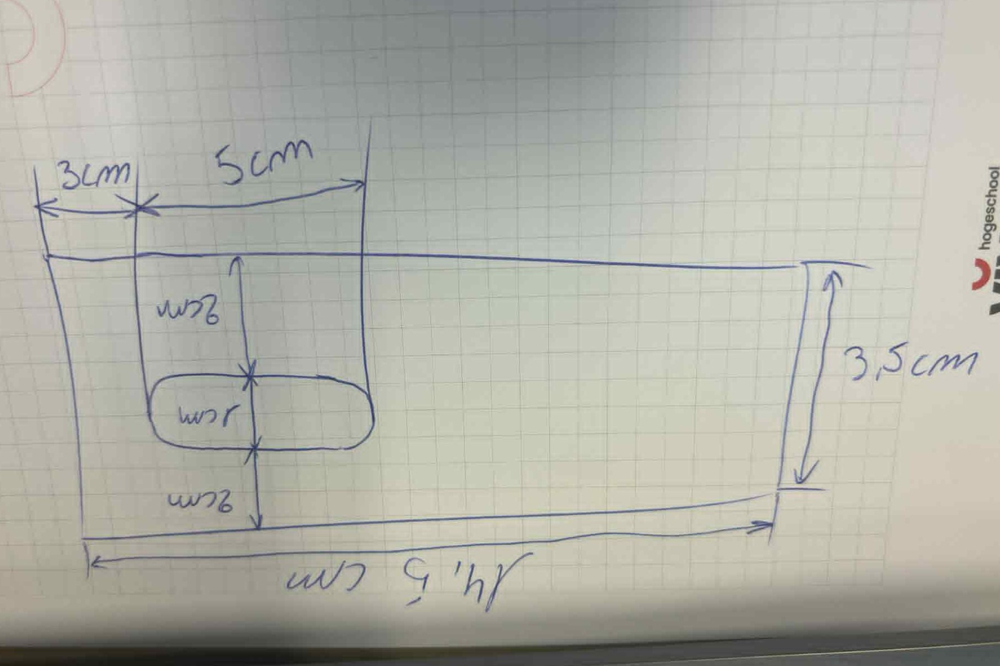
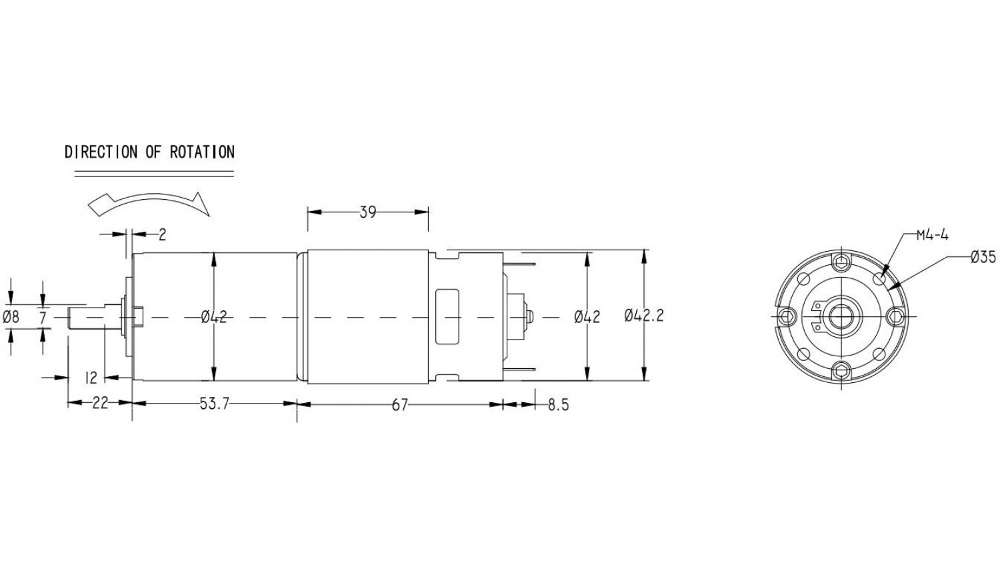
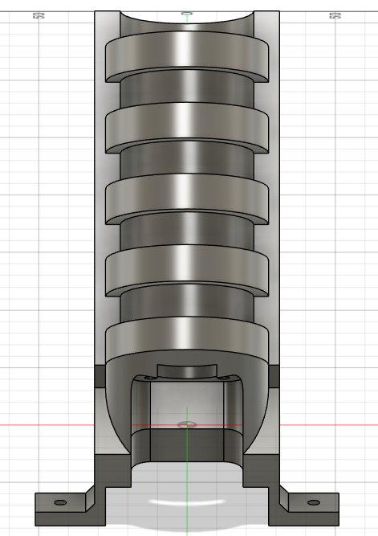
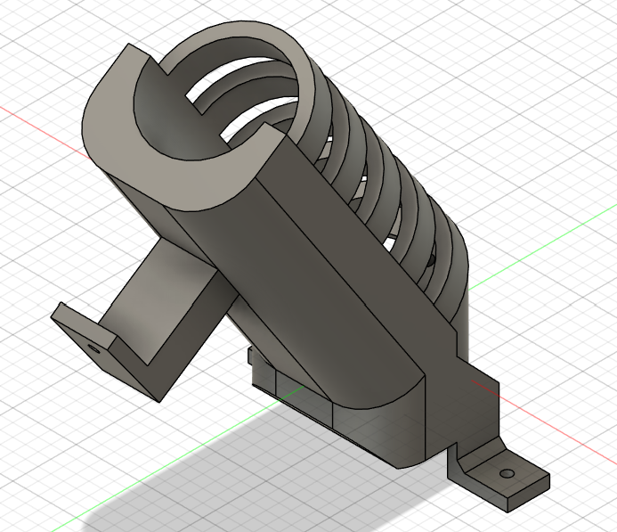
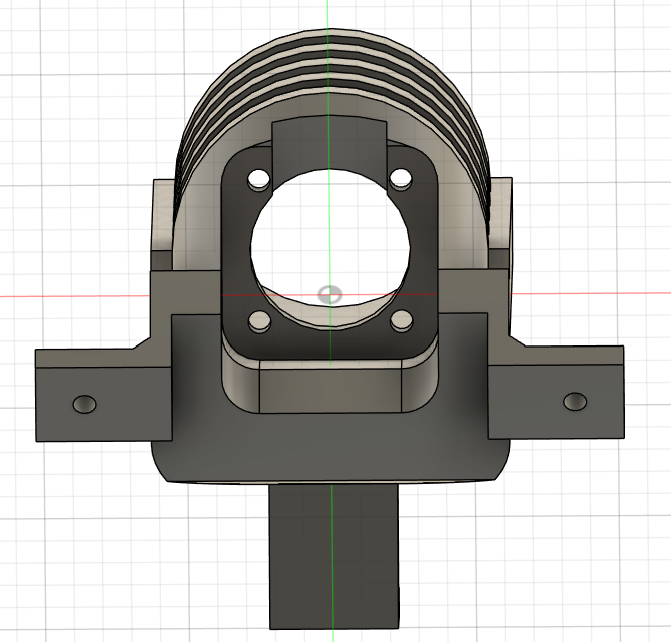
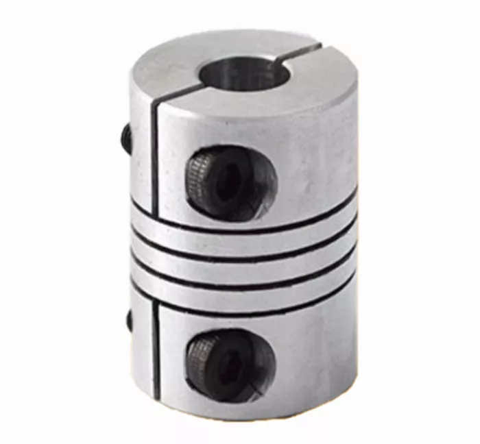
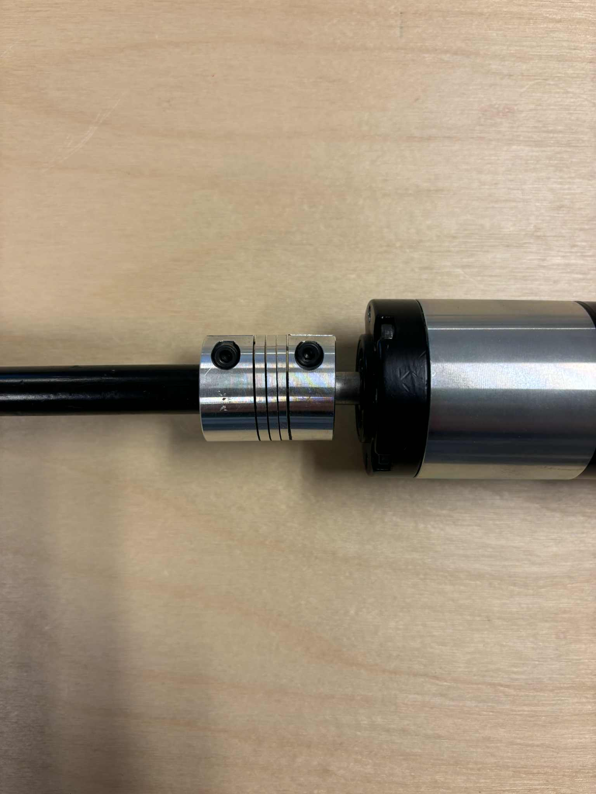

# Stuurmechanisme met DC-Motor

Voor de auto met joystickbesturing gebruiken we een **DC-Motor** om de **voorwielen te laten draaien**.  
Om een betrouwbare en precieze werking te garanderen, moest deze motor **stevig en netjes bevestigd** worden op het chassis van de auto.  
Hieronder volgt een overzicht van het volledige ontwerpproces, van plaatsbepaling tot het 3D-ontwerp van de houder.

---

### Plaatsbepaling op de auto

Eerst hebben we onderzocht **waar op de auto** de DC-Motor het best gemonteerd kon worden.  
We kozen de locatie **boven het gat waar normaal de stalen stuurstang** doorheen loopt. Dit is de mechanische verbinding die oorspronkelijk voor de besturing zorgde.  
Op deze plek is **voldoende ruimte** om de DC-Motor **in dezelfde hoek** als de stang te plaatsen, wat dus zorgt voor een optimale krachtsoverdracht op het stuurmechanisme.

  

Hier zie je op de foto het gat (waar de stang doorheen loopt) waarop we de DC-motor bovenop zullen bevestigen.

### Opmeten en voorbereiden

Daarna hebben we de gekozen positie **uitgemeten** en op papier overgezet.  
Zo konden we bepalen **hoe groot de DC-Motor houder mocht zijn** en controleren of er **voldoende plaats** was in de omgeving van het stuurmechanisme.  
Bij deze stap hielden we rekening met de **afmetingen van de DC-Motor zelf** en eventuele ruimte voor bevestigingsvijzen.

  
  

### Ontwerp in Fusion 360

Om de motor te kunnen bevesitgen op de auto hebben we gekozen om hier voor een **3D-ontwerp** te maken in **Fusion 360**. 

Het model is zo ontworpen dat de **DC-Motor perfect in de houder past** en via 4 montage gaten (M4) vanonder kan vast gemaakt worden aan de houder zelf. Dit voorkomt dat de motor beweegt tijdens het gebruik.  
Daarnaast bevat het ontwerp nog 3 **montagegaten van 4 mm diameter**, waarmee de houder met bouten **stevig op de auto kan worden bevestigd**.

Het ontwerp is zo gemaakt dat de as exact in lijn staat met de originele stang, dus ook onder dezelfde hoek. Dit is bewust gedaan, omdat we de originele stang opnieuw gaan gebruiken.

  
  
  

### Verbinding met stuurmechanisme
Wanneer de DC-motor eenmaal op de juiste positie is bevestigd via de printplaat, moet de motoras nog gekoppeld worden aan het stuurmechanisme. We maken hiervoor gebruik van de originele stang, omdat het uiteinde daarvan perfect past in de onderzijde van het stuurmechanisme. 

Voor de verbinding tussen de motoras en de stang gebruiken we een flexibele assenkoppeling (Assen Koppeling flexibel Mot D25L30, 8/12 mm). Deze koppeling sluit aan de ene kant perfect aan op de 8 mm motoras en aan de andere kant op de 12 mm stang. Beide zijden kunnen stevig worden vastgezet met inbusbouten, waarvoor een 2 mm en 2,5 mm inbussleutel nodig is. 

De stang moest natuurlijk nog worden ingekort, omdat deze in de nieuwe configuratie veel minder lang hoeft te zijn. De stang is vanaf de bovenkant … ingekort. Hieronder zie je het complete eindresultaat van het aangepaste stuurmechanisme dat nu door de DC-motor wordt aangedreven.

### Resultaat
...
