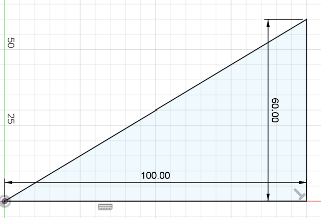
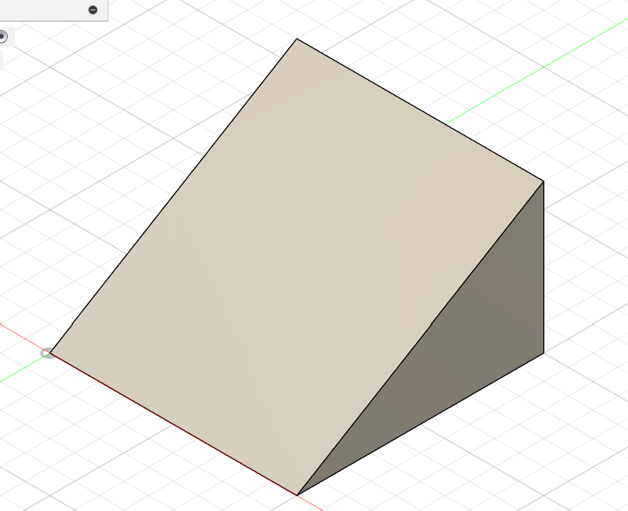
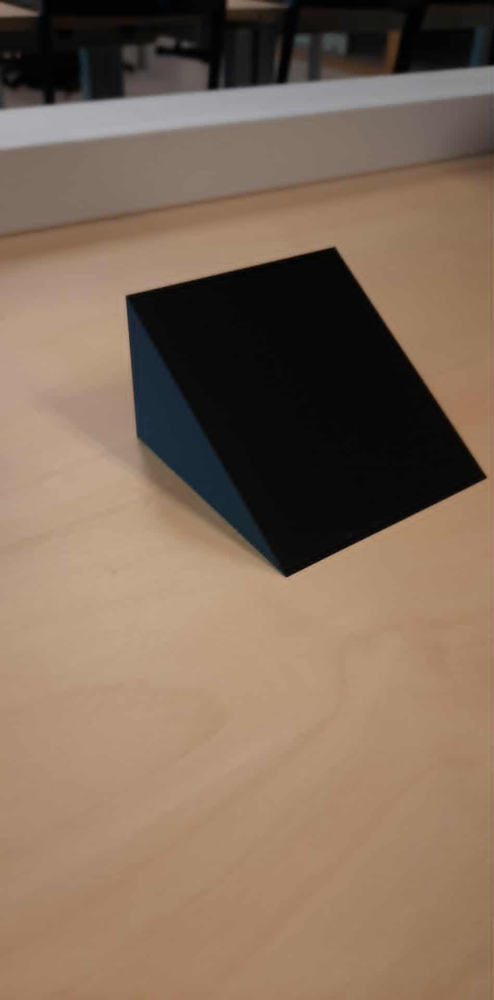
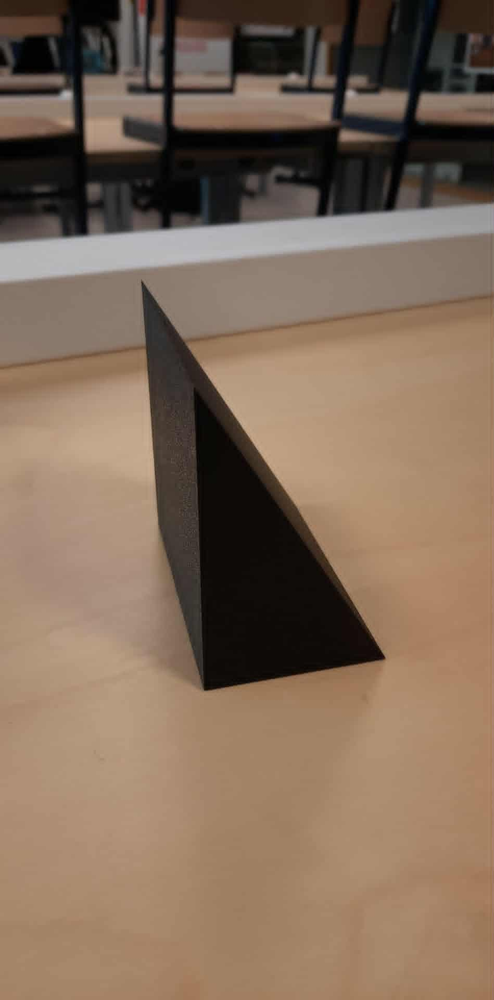

# Verhoging stoeltje

Hier vind je informatie over een klein stukje dat we zullen 3D-printen voor het stoeltje te verhogen op aanvraag van Lieve.

## Voorstel gekregen door Ergo
We hebben een voorstel gekregen voor de stoel hoger te doen kantelen zodat het kindje veilig in de auto kan zitten.
Ergo zei voor een stukje te 3D-printen en dan zo een groot genoeg stukje te hebben.

## Schets voor stukje
We maakten een schets voor het stukje met gekregen afmetingen.
- hoogte = 6cm
- lengte = 10cm

Voor dit visueel voor te stellen zal ik een foto van mijn schets tonenen ook nog een 3D beeld.

Eindresultaat van het verhoogstuk:

