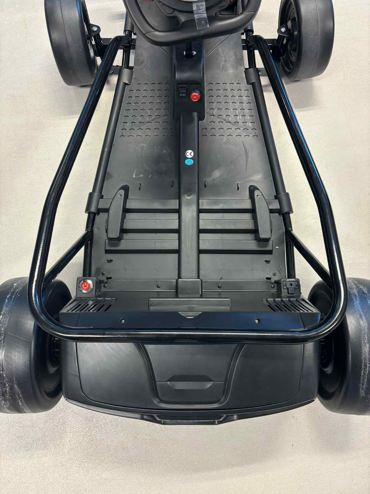
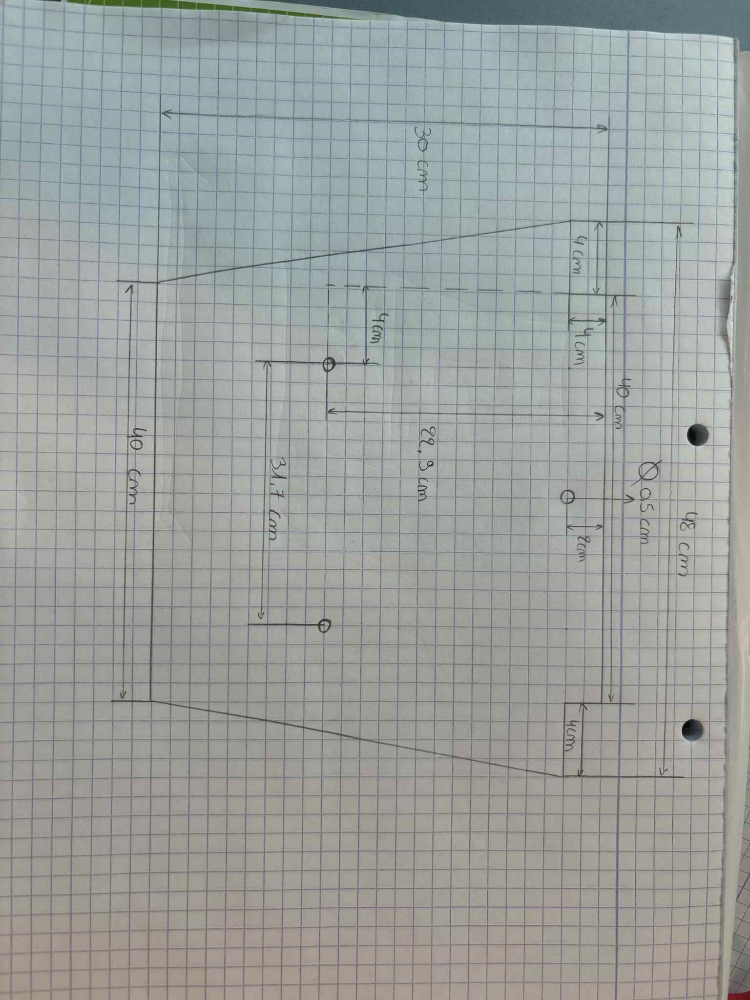
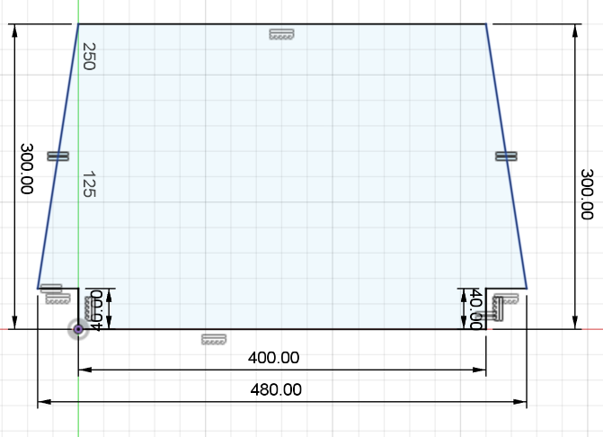
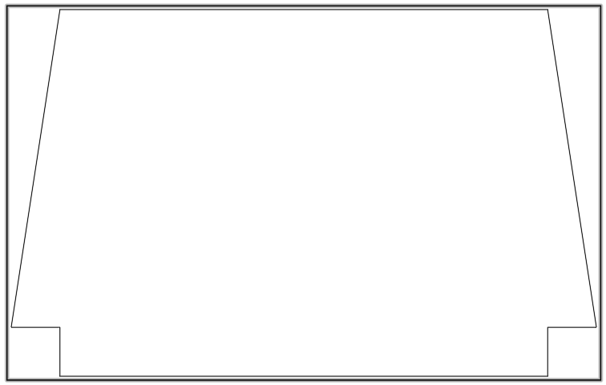
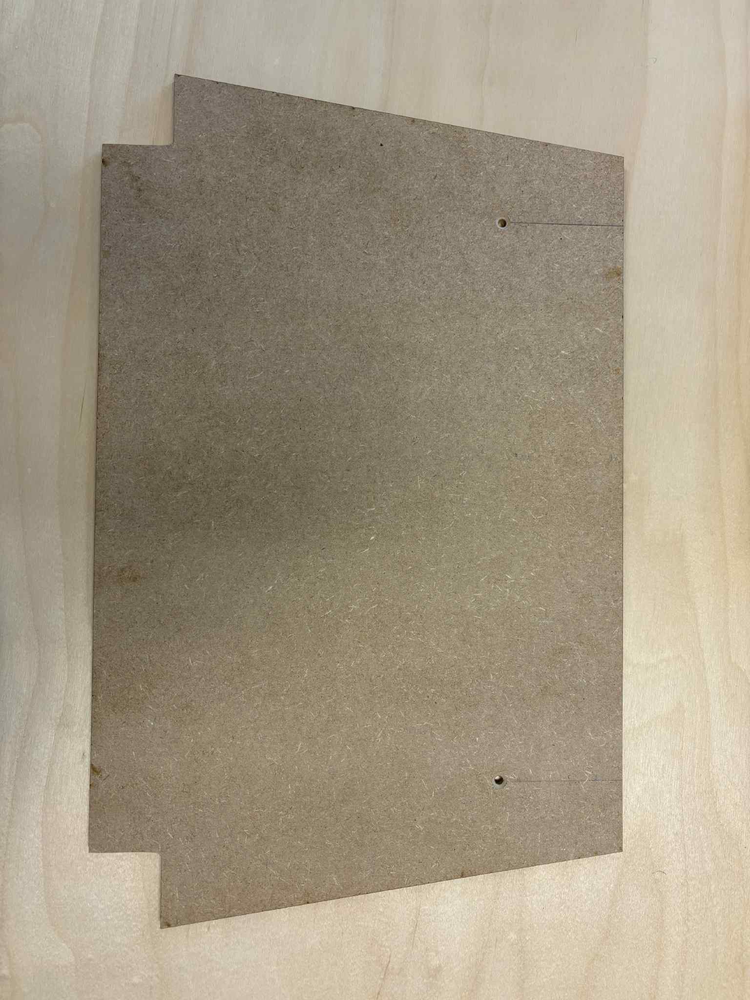
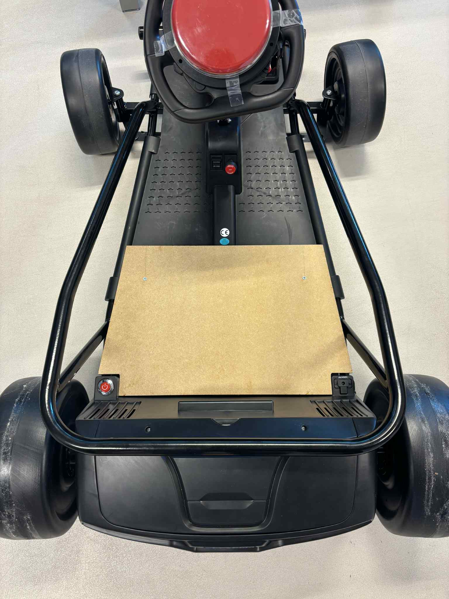

# Grondplaat

Hier vind je alle informatie over de **grondplaat** die we hebben ontworpen en gemaakt.  
Op deze plaat kan de stoel worden bevestigd met behulp van **velcrostrips**.

## Stap 1: Stoel ontkoppelen van de auto

Eerst hebben we de stoel losgekoppeld van de auto om een correcte basis te hebben voor de grondplaat.

**Foto:**  

## Stap 2: Schets

We maakten een schets op papier van hoe de grondplaat eruit moest zien.  
Hierbij noteerden we meteen de juiste afmetingen om later nauwkeurig te kunnen werken.

**Foto:**  

## Stap 3: Ontwerp in Fusion 360

Op basis van de papieren schets maakten we een digitale tekening in **Fusion 360**.  
Van deze tekening exporteerden we een **DXF-bestand**, zodat de grondplaat later kon worden uitgesneden met de **lasercutter**.

**Foto:**  

## Stap 4: Laser cutten en afwerking

Voor de grondplaat gebruikten we een **MDF-plaat van 6 mm dikte**.  
Dit materiaal is stevig genoeg om het gewicht van een kind te dragen.

Na het lasercutten hebben we de gaten nauwkeurig afgemeten en **handmatig geboord** (diameter 5 mm).  
Daarna bevestigden we de plaat met **twee vijzen** aan de auto.

Tot slot hebben we **velcrostrips** op de grondplaat aangebracht, zodat de stoel eenvoudig kan worden vastgemaakt en indien nodig weer aangepast.

**Foto:**  

