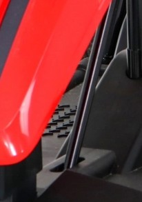
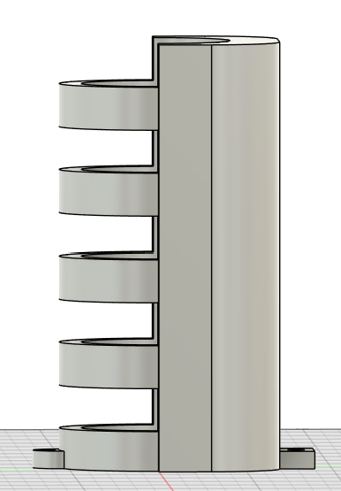
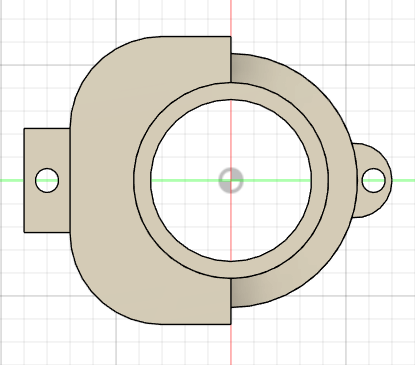
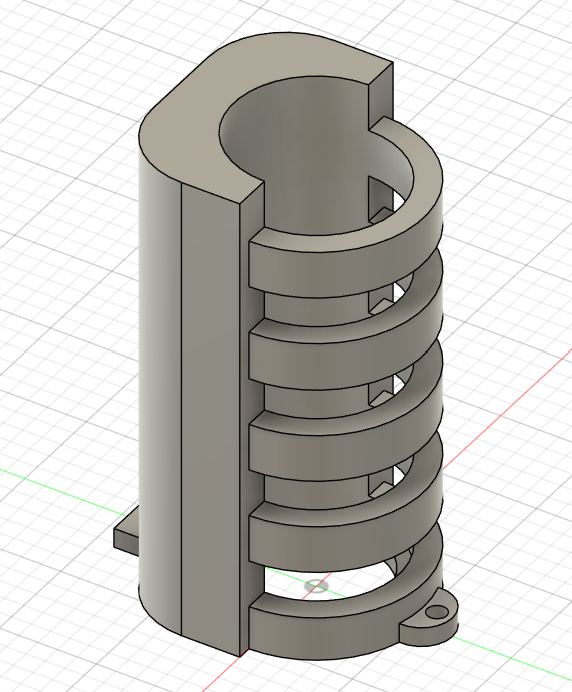

# Servo Houder – Stuurmechanisme met Servo Motor

Voor de auto met joystickbesturing gebruiken we een **servo motor** om de **voorwielen te laten draaien**.  
Om een betrouwbare en precieze werking te garanderen, moest deze motor **stevig en netjes bevestigd** worden op het chassis van de auto.  
Hieronder volgt een overzicht van het volledige ontwerpproces, van plaatsbepaling tot het 3D-ontwerp van de houder.

---

### Plaatsbepaling op de auto

Eerst hebben we onderzocht **waar op de auto** de servo het best gemonteerd kon worden.  
We kozen de locatie **boven het gat waar normaal de stalen stuurstang** doorheen loopt. Dit is de mechanische verbinding die oorspronkelijk voor de besturing zorgde.  
Op deze plek is **voldoende ruimte** om de servo **rechtop te plaatsen**, wat ook zorgt voor een optimale krachtsoverdracht op het stuurmechanisme.

  

---

### Opmeten en voorbereiden

Daarna hebben we de gekozen positie **nauwkeurig uitgemeten** en op papier overgezet.  
Zo konden we bepalen **hoe groot de servo houder mocht zijn** en controleren of er **voldoende plaats** was in de omgeving van het stuurmechanisme.  
Bij deze stap hielden we rekening met de **afmetingen van de servo motor zelf** en eventuele ruimte voor bevestigingsvijzen.

  
  

---

### Ontwerp in Fusion 360

Na de voorbereidende metingen hebben we in **Fusion 360** een **3D-ontwerp** van de servo houder gemaakt.  
Het model is zo ontworpen dat de **servo perfect in de houder past**, met een stevige klemvormige passing die voorkomt dat de motor beweegt tijdens gebruik.  
Daarnaast bevat het ontwerp **montagegaten van 5 mm diameter**, waarmee de houder met bouten of vijzen **direct op de auto kan worden bevestigd**.

  
  
  

---

### Resultaat

