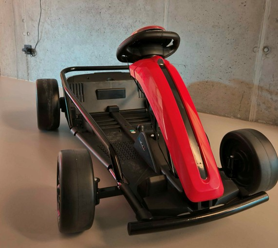

## 1e instagram post
### Tekst:
🚗Plezier op wielen zonder zorgen 🚗

De doelstelling van dit project is om kinderen met een motorische beperking de mogelijkheid te geven zich zelfstandig voort te bewegen. Dit realiseren we met een auto waarbij het gaspedaal is vervangen door een knop op het stuur ook verbeteren we de veiligheid. De oorspronkelijke GoBabyGo auto was bedoeld voor jongere kinderen, maar nu ontwikkelen we een XL-versie voor kinderen die inmiddels te groot zijn geworden voor het vorige model.

Foto: 

