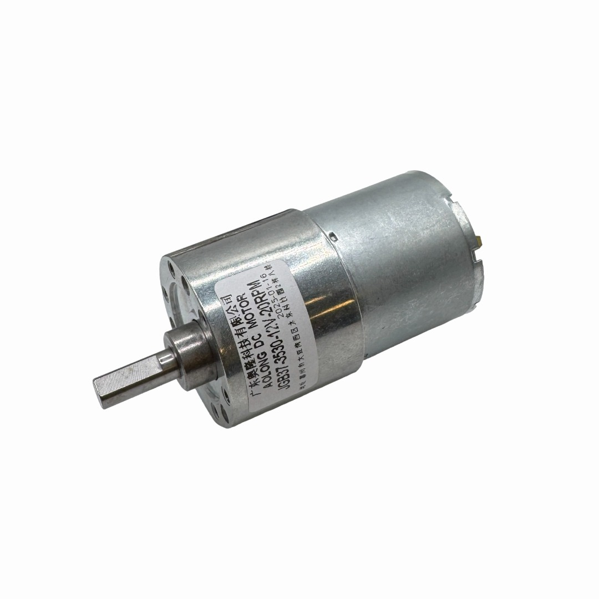
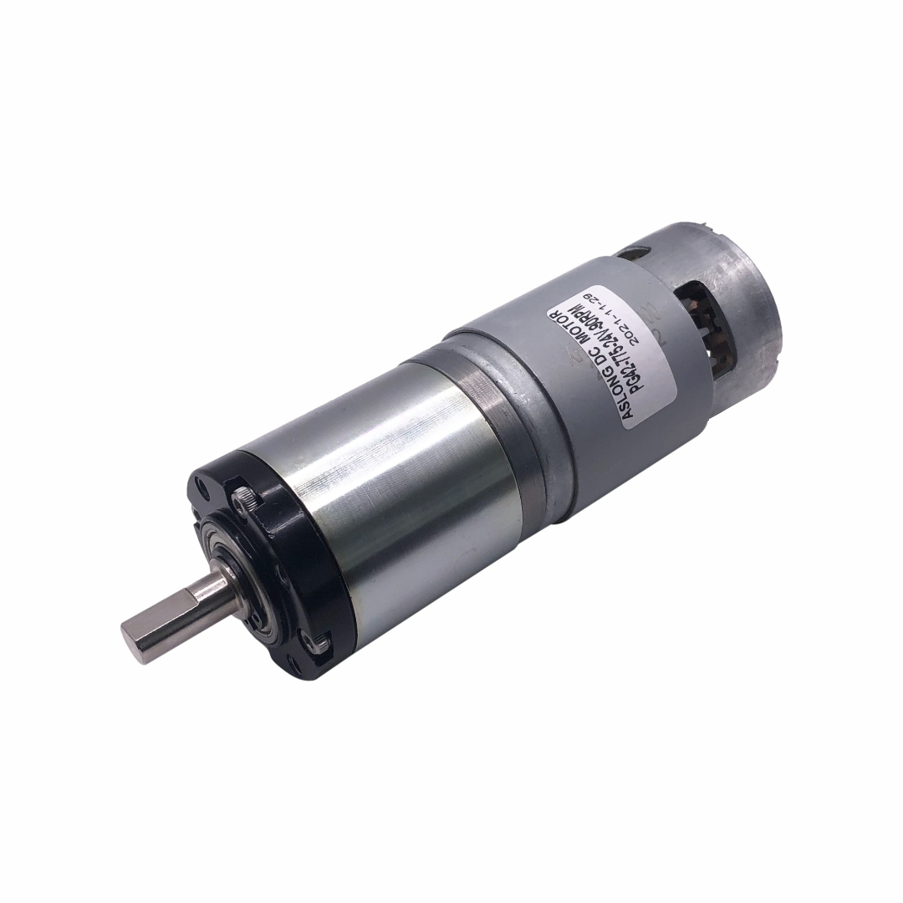

# DC-Motor

We hebben ervoor gekozen om twee DC-Motoren aan te kopen, omdat we nog niet precies weten hoe krachtig de DC-Motor moet zijn. Hieronder staan de twee aangekochte DC-Motoren met hun specificaties.

## DC-Motor 1

Dit is de eerste DC-Motor dat we hebben gekozen namelijk de : Aslong JGB37-3530

 

### Specificaties
- DC-Motor
- Voeding: 12V
- Stroom: 200mA
- Max snelheid : 20rpm
- Max houdkoppel: 7,3 N.m

## DC-Motor 2 
Dit is de tweede DC-Motor dat we hebben gekozen namelijk de :Aslong PG42-775

### Specificaties
- DC-Motor
- Voeding: 24V
- Stroom: 500mA
- Max snelheid : 88rpm
- Max houdkoppel: 12 N.m

Voor de montage van de joystick hebben we volgende dingen nodig
2 korte bouten
2 lange bouten 
4 moertjes
de 3de print joystick box
de 3de print joystick montage
en de joystick zelf

Dan kun je de vijzen opnieuw hergebruiken om de box terug vast te maken je hebt ook nog het kleine stuk 3de print nodig voor de box goed te monteren
foto klein stukje (hebben we nog niet)
Dan kun we de box goed monteren zodat deze goed vast staat en dan kan je terug het rode stuk montern met nodig aanpassing
foto aanpassing rood(hebben we nog niet)
foto eindtotaal montage box (hebben we nog niet)
