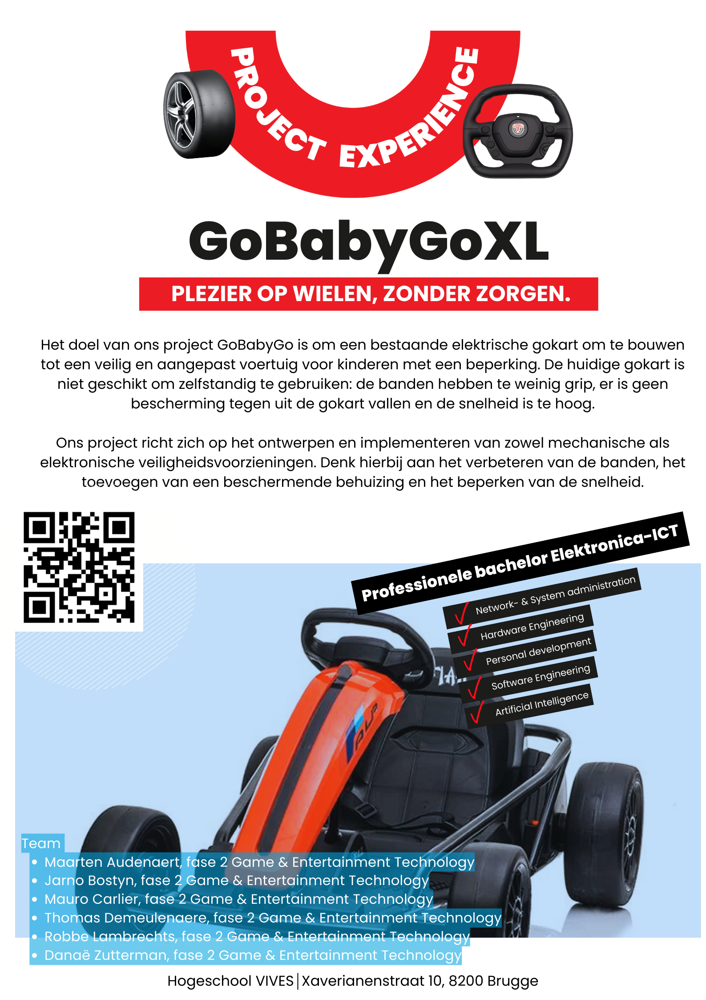

# GOBABYGOXL
## Team
- [Maarten Audenaert](https://github.com/MaartenAudenaert)
- [Mauro Carlier](https://github.com/maurocarlier)
- [Danae Zutterman](https://github.com/Danaezutterman)
- [Robbe Lambrechts](https://github.com/lomopoio)
- [Thomas Demeulenaere](https://github.com/Thomas8650)
- [Jarno Bostyn](https://github.com/Jarno-max)

## De opdracht
De bedoeling is om verder te werken op het GoBabyGo-project van de vorige jaren. De doelstelling van dit project is om kinderen 
met een motorische beperking toch zelfstandig te kunnen laten voortbewegen. Dit wordt gedaan door middel van een auto waarvan 
we het gaspedaal vervangen door een knop op het stuur. De GoBabyGo was voor iets kleinere kinderen en nu is het de bedoeling dat we een 
XL-versie maken voor kinderen die te groot zijn geworden voor de vorige auto.

## Affiches

## Folder structuur
- [3d-prints](./3d-prints/readme.md) : Hier bevindt alles om onderdelen te 3D-printen.
- [Affiches](./Affiches/GoBabyGoXL_poster.png ) : Hier vindt u onze poster.
- [Archief](./Archief/README.md) : Hier vindt u al onze research.
- [Gaspedaal naar knop](./Gaspedaal%20naar%20knop/README.md) : Hier bevindt alles van hoe we het  gaspedaal hebben vervangen door een knop. 
- [Grip banden](./Grip%20banden/README.md) : Hier bevindt alles hoe we de grip van de banden verbeteren.
- [Handleidingen](./Handleidingen/readme.md) : Hier vindt u de handleidingen voor het aanpassen van de auto.
- [Inriching auto](<Inrichting auto/README.md>) : Hier bevindt alles hoe we de auto veilig maken voor het kind.
- [Instagram post](./Instagram%20Post/Readme.md) : Hier vindt u onze instagram post.
- [Joystick](./joystick/readme.md): Hier wordt er nagedacht over de uitbreiding met een joystick.

