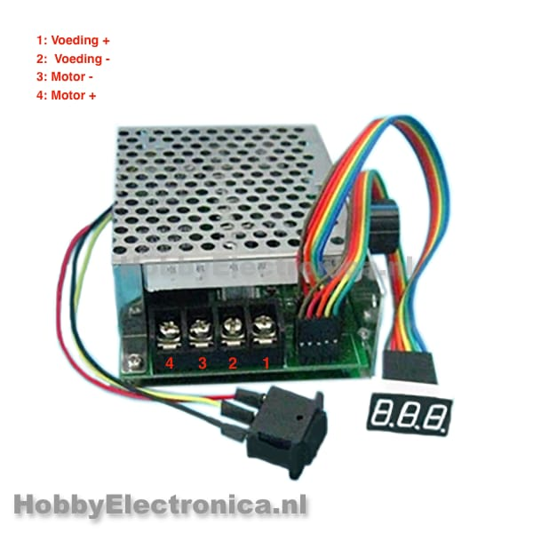

# Snelheidsbegrenzing
Dit is een bestand over de onderdelen die we onderzocht hebben om mogelijks aan te kopen om de snelheid te begrenzen.

## Snelheidsbegrenzer
### Mogelijke opties

#### DC 10-50V PWM motor controller met schakelaar
   

Dit is een motor controller met een veelzijdige schakelaar met een ingangsspanning van 12V, 24V, 36V of 48V, ontworpen voor het regelen van de snelheid en richting van gelijkstroommotoren. Met behulp van Pulse Width Modulation (PWM) kan de regelaar de motorsnelheid nauwkeurig aanpassen. Dit zorgt ervoor om de rotatiesnelheid van de motor te veranderen en aan te passen. Ook is er een schakelaar om de motor in of uit te schakelen.

- Een ingangsspanning van 10V DC tot 55V DC
- De uitgangsspanningis lineair met de belasting
- De maximum stroom is 40A
- Er is vooruit & achteruit ondersteuning
- Het is regelbaar via een 100K potentiometer
- Een bestuuringsfrequentie van 15 Khz

#### DC motor snelheidsregelaar 9-60V

Deze motor maakt het mogelijk gelijkstroommotoren te bedienen. Met de vooruit/achteruit schakelaar verander je eenvoudig de draairichting en met de potmeter regel je de snelheid. Met behulp van Pulse Width Modulation (PWM) kan de regelaar de motorsnelheid nauwkeurig aanpassen. Dit zorgt ervoor om de rotatiesnelheid van de motor te veranderen en aan te passen.

- Bedrijfsspanning: DC9V-60V
- lineaire uitgangsspanning onder belasting
– Aanhoudende stroom: 18A
– Snelheidspotentiometer
– Vooruit en achteruit
