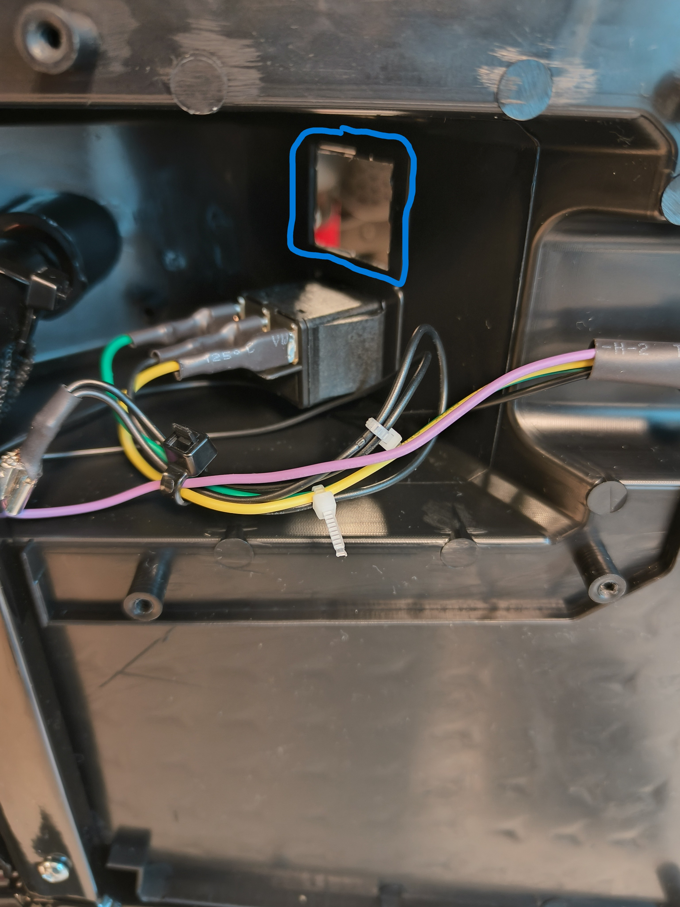
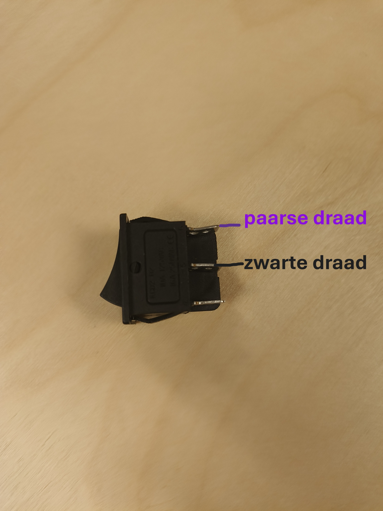

# Snelheidsbegrenzing
Dit is een bestand over hoe we de snelheid van de auto's hebben aangepast.

## Snelheidsbegrenzer
### Huidige motor

#### HY2005M-HL-24V

Dit is de motor die momenteel in de auto zit. De motor controller heeft een schakelaar met een ingangsspanning van 24V, dit is ontworpen voor het regelen van de snelheid in twee standen (low speed & high speed) en de richting (vooruit & achteruit).

- Een ingangsspanning van 24V DC
- De maximum stroom is 40A
- Er is vooruit & achteruit ondersteuning
- Er zijn 2 driver motoren aangesloten
- Schakelaar voor 2 standen (low speed & high speed)

---

## Aanpak
We zullen de schakelaar voor de HIGH en LOW speed aanpassen in plaats van een nieuwe motor aan te kopen. Hieronder vindt u het stappenplan.

### Stappenplan
1) Eerst open je de bescherming die aan de onderkant zit van de auto, dit doe je door de vijsjes los te maken. 
Nadat je het geopend hebt, vind je hier de schakelaar (de opening die in het blauw omcirkelt is). 
Deze schakelaar maak je los, alsook de connector van de paarse en de zwarte draad.

**Bescherming en Binnenkant**

   
   

**Schakelaar**

   
   

2) Nadat je de schakelaars los hebt gekregen, alsook de paarse draad. Knip je de connector van de paarse draad door.
   Steek de paarse draad onder het metalen gedeelte zodanig dat het goed aangespannen is en hij niet snel zal los komen.
   Nu soldeer je de paarse draad aan de connector van de zwarte draad. 

**De gesoldeerde verbinding**

  
---

### Werking van de schakelaar
Wanneer je de paarse draad met de zwarte draad verbindt zet je de schakelaar hoog waardoor je LOW SPEED krijgt.

Wanneer je de zwarte draad aan de andere connector verbindt die ongebruikt is, blijft het op HIGH SPEED staan. 
