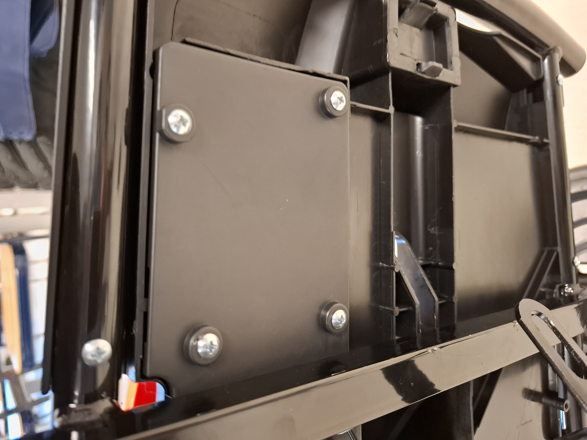
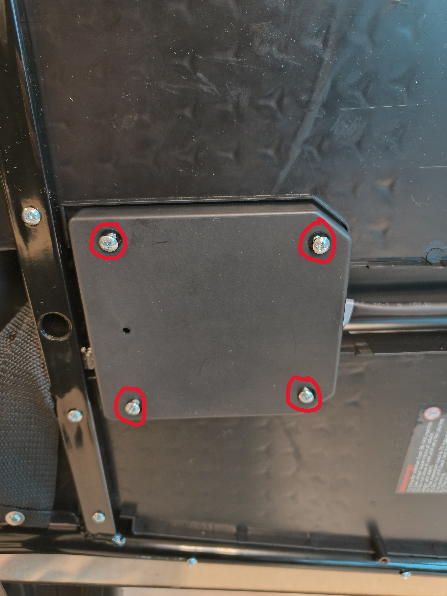
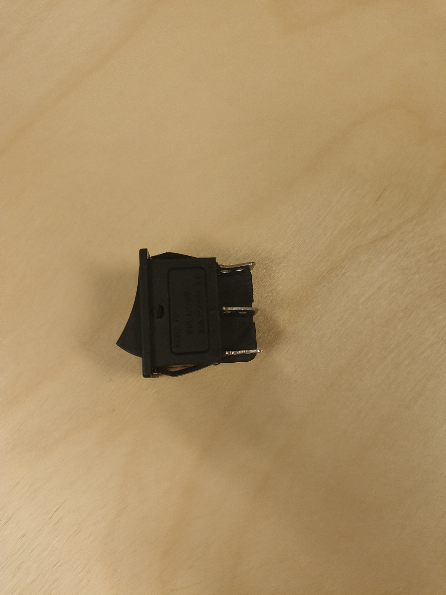
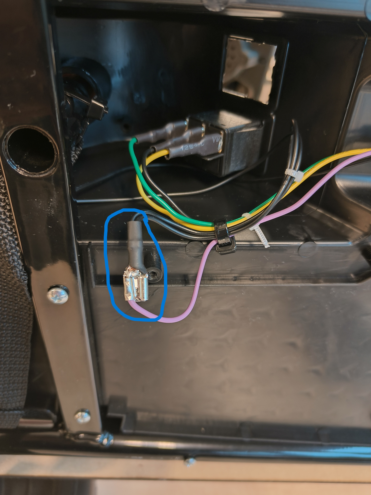

# Legende
[**Installatie van de knop**](#Knop%20installeren) 

[**Begrenzen van de snelheid**](#Snelheidsbegrenzing) 

## Knop installeren

Als eerste maak je de vier schroeven los zodat je het gaspedaal kunt verwijderen.

Het gaspedaal verwijder je door het met wat kracht omhoog te duwen.

Vervolgens knip je de zwarte kabels die aan het gaspedaal vastzitten los.

Daarna verleng je de draden van de knop en de kabels van het gaspedaal, en soldeer je deze zorgvuldig aan elkaar.

## Knop installeren

Als eerste maak je de vier schroeven los zodat je het gaspedaal kunt verwijderen.

Het gaspedaal verwijder je door het met wat kracht omhoog te duwen.

Vervolgens knip je de zwarte kabels die aan het gaspedaal vastzitten los.

Daarna verleng je de draden van de knop en de kabels van het gaspedaal, en soldeer je deze zorgvuldig aan elkaar.

## Snelheidsbegrenzing

1) Eerst open je de bescherming die aan de onderkant zit van de auto, dit doe je door de vijsjes los te maken. 
Nadat je het geopend hebt, vind je hier de schakelaar (de opening die in het blauw omcirkelt is). 
Deze schakelaar maak je los, alsook de connector van de paarse en de zwarte draad.

**Bescherming en Binnenkant**

   
   

**Schakelaar**

   
   

2) Nadat je de schakelaars los hebt gekregen, alsook de paarse draad. Knip je de connector van de paarse draad door.
   Steek de paarse draad onder het metalen gedeelte zodanig dat het goed aangespannen is en hij niet snel zal los komen.
   Nu soldeer je de paarse draad aan de connector van de zwarte draad. 

**De gesoldeerde verbinding**

  
