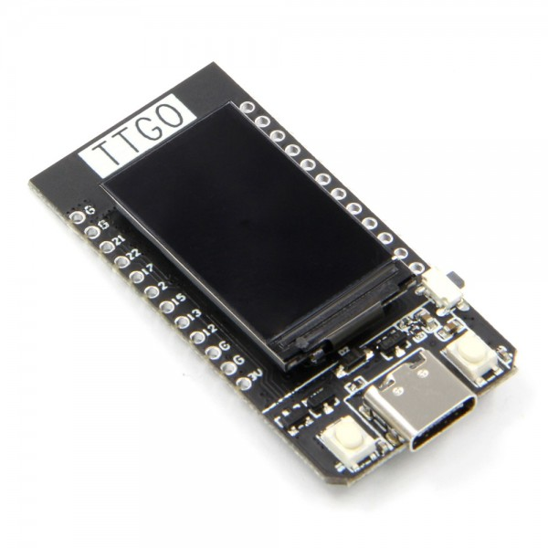

# joystick

## Doelstelling
Het doel hiervan is dat we het originele stuur met de drukknop aanpassen naar een joystick die eigenlijk alles doet zowel vooruit als achteruit rijden (dit wordt gedaan door de vooruit- achteruitstick te verwisselen met de joystick) en ook als we de joystick naar links of rechts bewegen dat de auto de gewenste richting opgaat. 

## Ideeën
Het idee is om een servomotor in plaats van het stuur te plaatsen die naar recht en links kan bewegen. Deze motor zou worden aangestuurd met een esp32 die dan zo ook aan de joystick hangt. Als de joystick een signaal dan aan de esp32 geeft zal deze dan reageren op het gewenste signaal. 

## mogelijk nodig materiaal
### Esp32
Zouden we gebruiken als microcontroller om alles aan te sturen. 
https://www.tinytronics.nl/nl/development-boards/microcontroller-boards/met-wi-fi/lilygo-ttgo-t-display-v1.1-esp32-met-1.14-inch-tft-display 

### Servomotor
Zouden we gebruiken om de originele stuuras die nu aan het stuur vasthangt te vervangen zodat we ook naar links en rechts kunnen sturen. We weten wel nog niet hoe sterk we onze servomotor moeten laten draaien dus dat moeten we nog eens uitzoeken. 

### Voeding
Misschien dat we hiervoor kijken voor een aparte powerbank voor de esp en de servomotor oftewel taken we af van de batterij zelf. Het hangt vooral ook af van hoeveel spanning en stroom de servomotor zal trekken. 

